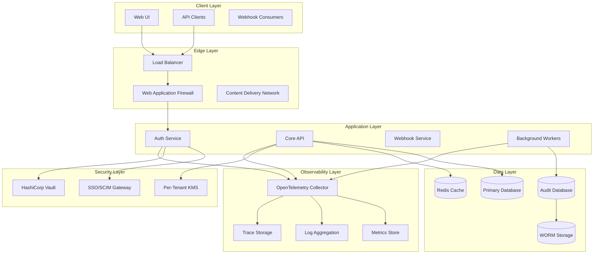
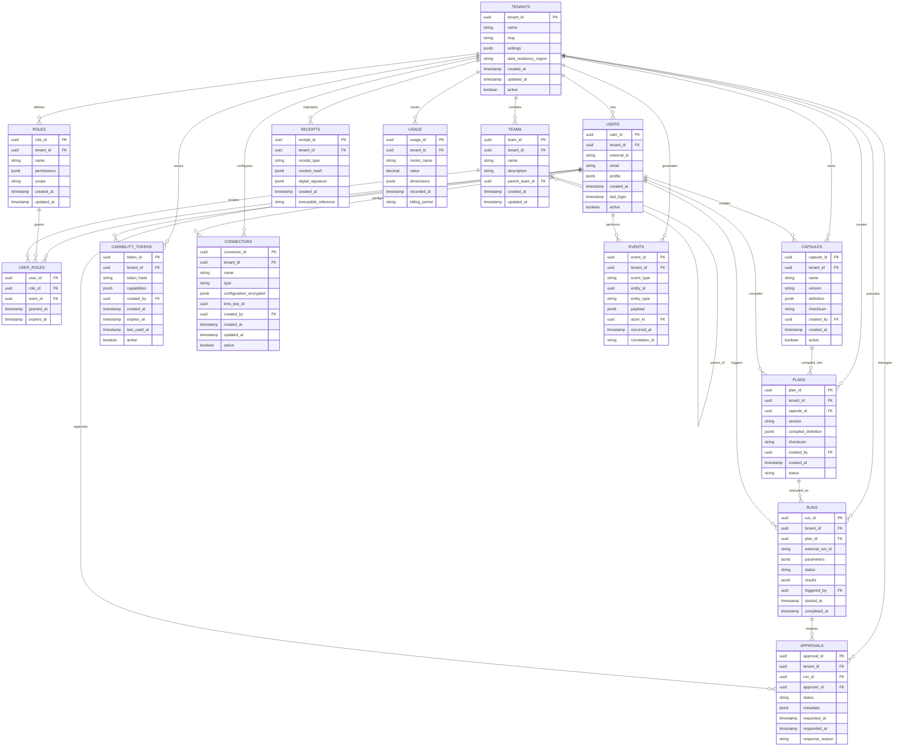

# Enterprise Non-Functional Requirements Design

## Overview

This design document outlines the architecture and implementation approach for Anumate's enterprise-grade non-functional requirements. The design focuses on multi-tenant security, privacy protection, comprehensive observability, and operational excellence while maintaining the specific SLOs defined in the requirements.

## Architecture

### High-Level Architecture



### Multi-Tenant Data Architecture



## Components and Interfaces

### Authentication and Authorization Service

**Purpose**: Handles SSO integration, SCIM provisioning, and tenant-aware authorization

**Key Components**:
- OIDC/SAML authentication handlers
- SCIM 2.0 provisioning endpoints
- JWT token management with tenant context
- Role-based access control (RBAC) engine

**Interfaces**:
```
POST /auth/sso/initiate
POST /auth/sso/callback
GET /auth/userinfo
POST /auth/logout

POST /scim/v2/Users
GET /scim/v2/Users
PUT /scim/v2/Users/{id}
DELETE /scim/v2/Users/{id}
```

### Multi-Tenant Data Service

**Purpose**: Enforces RLS policies and manages tenant data isolation

**Key Components**:
- Database connection pooling with tenant context
- RLS policy enforcement engine
- Tenant-aware query builders
- Data residency compliance checker

**RLS Implementation**:
```sql
-- Example RLS policy for users table
CREATE POLICY tenant_isolation ON users
    FOR ALL TO application_role
    USING (tenant_id = current_setting('app.current_tenant_id')::uuid);
```

### Secrets Management Service

**Purpose**: Integrates with HashiCorp Vault and manages per-tenant KMS keys

**Key Components**:
- Vault authentication and token management
- Per-tenant KMS key provisioning
- Secret rotation automation
- Encrypted configuration management

**Vault Integration**:
```
vault auth -method=kubernetes
vault kv get -mount=secret tenants/{tenant_id}/config
vault transit encrypt -key={tenant_id} plaintext={data}
```

### Privacy Protection Service

**Purpose**: Detects and redacts PII across all system outputs

**Key Components**:
- PII detection engine using regex and ML models
- Log sanitization middleware
- Data export redaction filters
- Privacy compliance reporting

**PII Detection Patterns**:
- Email addresses: `\b[A-Za-z0-9._%+-]+@[A-Za-z0-9.-]+\.[A-Z|a-z]{2,}\b`
- Phone numbers: `\b\d{3}-\d{3}-\d{4}\b`
- SSN: `\b\d{3}-\d{2}-\d{4}\b`
- Credit cards: `\b\d{4}[\s-]?\d{4}[\s-]?\d{4}[\s-]?\d{4}\b`

### Observability Service

**Purpose**: Implements OpenTelemetry tracing, metrics, and structured logging

**Key Components**:
- OpenTelemetry SDK integration
- Custom metrics collectors
- Structured logging middleware
- Distributed tracing context propagation

**Telemetry Configuration**:
```yaml
otel:
  service_name: anumate-api
  traces:
    endpoint: http://jaeger:14268/api/traces
  metrics:
    endpoint: http://prometheus:9090/api/v1/write
  logs:
    endpoint: http://loki:3100/loki/api/v1/push
```

### Audit Service

**Purpose**: Manages immutable audit logs with WORM storage

**Key Components**:
- Event capture middleware
- WORM storage integration
- Audit trail query engine
- Compliance reporting generator

**Audit Event Schema**:
```json
{
  "event_id": "uuid",
  "tenant_id": "uuid",
  "timestamp": "ISO8601",
  "actor": {
    "user_id": "uuid",
    "ip_address": "string",
    "user_agent": "string"
  },
  "action": "string",
  "resource": {
    "type": "string",
    "id": "uuid"
  },
  "outcome": "success|failure",
  "metadata": {}
}
```

## Data Models

### Entity Specifications

#### Tenants
- **Fields**: tenant_id (PK), name, slug, settings, data_residency_region, created_at, updated_at, active
- **Relationships**: One-to-many with all other entities
- **Tenancy Boundary**: Root entity - defines tenant boundary
- **Retention Policy**: Indefinite (business entity)
- **Access Rules**: System administrators only

#### Users
- **Fields**: user_id (PK), tenant_id (FK), external_id, email, profile, created_at, last_login, active
- **Relationships**: Belongs to tenant, has many roles through user_roles
- **Tenancy Boundary**: Isolated by tenant_id
- **Retention Policy**: 7 years after account deletion
- **Access Rules**: Self-read, tenant admins full access

#### Teams
- **Fields**: team_id (PK), tenant_id (FK), name, description, parent_team_id (FK), created_at, updated_at
- **Relationships**: Belongs to tenant, self-referential hierarchy
- **Tenancy Boundary**: Isolated by tenant_id
- **Retention Policy**: 3 years after team dissolution
- **Access Rules**: Team members read, team admins write

#### Roles/Permissions
- **Fields**: role_id (PK), tenant_id (FK), name, permissions (JSONB), scope, created_at, updated_at
- **Relationships**: Belongs to tenant, many-to-many with users
- **Tenancy Boundary**: Isolated by tenant_id
- **Retention Policy**: 5 years after role deletion
- **Access Rules**: Tenant admins only

#### Capsules (Versioned)
- **Fields**: capsule_id (PK), tenant_id (FK), name, version, definition (JSONB), checksum, created_by (FK), created_at, active
- **Relationships**: Belongs to tenant, created by user, has many plans
- **Tenancy Boundary**: Isolated by tenant_id
- **Retention Policy**: Indefinite (business logic)
- **Access Rules**: Creator and authorized team members

#### Plans (Compiled)
- **Fields**: plan_id (PK), tenant_id (FK), capsule_id (FK), version, compiled_definition (JSONB), checksum, created_by (FK), created_at, status
- **Relationships**: Belongs to tenant and capsule, created by user
- **Tenancy Boundary**: Isolated by tenant_id
- **Retention Policy**: 2 years after last execution
- **Access Rules**: Plan executors and approvers

#### Runs (PlanRun Mirror)
- **Fields**: run_id (PK), tenant_id (FK), plan_id (FK), external_run_id, parameters (JSONB), status, results (JSONB), triggered_by (FK), started_at, completed_at
- **Relationships**: Belongs to tenant and plan, triggered by user
- **Tenancy Boundary**: Isolated by tenant_id
- **Retention Policy**: 5 years for compliance
- **Access Rules**: Run participants and auditors

#### Approvals
- **Fields**: approval_id (PK), tenant_id (FK), run_id (FK), approver_id (FK), status, metadata (JSONB), requested_at, responded_at, response_reason
- **Relationships**: Belongs to tenant and run, assigned to user
- **Tenancy Boundary**: Isolated by tenant_id
- **Retention Policy**: 7 years for audit compliance
- **Access Rules**: Approver and audit trail viewers

#### Capability Tokens
- **Fields**: token_id (PK), tenant_id (FK), token_hash, capabilities (JSONB), created_by (FK), created_at, expires_at, last_used_at, active
- **Relationships**: Belongs to tenant, created by user
- **Tenancy Boundary**: Isolated by tenant_id
- **Retention Policy**: 1 year after expiration
- **Access Rules**: Token creator and tenant admins

#### Connectors (Per Tenant)
- **Fields**: connector_id (PK), tenant_id (FK), name, type, configuration_encrypted (JSONB), kms_key_id, created_by (FK), created_at, updated_at, active
- **Relationships**: Belongs to tenant, created by user
- **Tenancy Boundary**: Isolated by tenant_id
- **Retention Policy**: 3 years after deletion
- **Access Rules**: Connector admins only

#### Events
- **Fields**: event_id (PK), tenant_id (FK), event_type, entity_id, entity_type, payload (JSONB), actor_id (FK), occurred_at, correlation_id
- **Relationships**: Belongs to tenant, performed by user
- **Tenancy Boundary**: Isolated by tenant_id
- **Retention Policy**: 10 years for audit compliance
- **Access Rules**: Audit viewers and compliance officers

#### Receipts (Immutable)
- **Fields**: receipt_id (PK), tenant_id (FK), receipt_type, content_hash (JSONB), digital_signature (JSONB), created_at, immutable_reference
- **Relationships**: Belongs to tenant
- **Tenancy Boundary**: Isolated by tenant_id
- **Retention Policy**: Permanent (legal requirement)
- **Access Rules**: Read-only, compliance officers only

#### Usage
- **Fields**: usage_id (PK), tenant_id (FK), metric_name, value (decimal), dimensions (JSONB), recorded_at, billing_period
- **Relationships**: Belongs to tenant
- **Tenancy Boundary**: Isolated by tenant_id
- **Retention Policy**: 7 years for billing compliance
- **Access Rules**: Billing admins and tenant owners

## Error Handling

### Error Classification
- **Authentication Errors**: 401 Unauthorized with specific error codes
- **Authorization Errors**: 403 Forbidden with tenant context
- **Validation Errors**: 400 Bad Request with field-level details
- **Rate Limiting**: 429 Too Many Requests with retry headers
- **System Errors**: 500 Internal Server Error with correlation IDs

### Error Response Format
```json
{
  "error": {
    "code": "TENANT_ACCESS_DENIED",
    "message": "Access to resource denied for tenant",
    "correlation_id": "uuid",
    "timestamp": "ISO8601",
    "details": {}
  }
}
```

### Circuit Breaker Implementation
- **Vault Integration**: 5 failures in 60 seconds triggers 30-second circuit break
- **Database Connections**: 10 failures in 30 seconds triggers 60-second circuit break
- **External APIs**: 3 failures in 10 seconds triggers 20-second circuit break

## Testing Strategy

### Security Testing
- **Tenant Isolation Tests**: Automated tests verifying RLS policy enforcement
- **Authentication Tests**: SSO integration testing with mock identity providers
- **Authorization Tests**: RBAC policy validation across all endpoints
- **Penetration Testing**: Quarterly third-party security assessments

### Performance Testing
- **Load Testing**: Simulate 10x expected load to validate SLO compliance
- **Stress Testing**: Push system to failure points to identify bottlenecks
- **Chaos Engineering**: Random failure injection to test resilience
- **SLO Validation**: Continuous monitoring of all defined service level objectives

### Compliance Testing
- **PII Detection**: Automated scanning for PII in logs and outputs
- **Audit Trail**: Verification of complete audit trail coverage
- **Data Residency**: Validation of geographic data constraints
- **Retention Policy**: Automated testing of data lifecycle management

### Integration Testing
- **Multi-Tenant Scenarios**: Cross-tenant isolation validation
- **Disaster Recovery**: Regular DR procedure testing
- **Backup/Restore**: Automated backup integrity verification
- **Observability**: End-to-end tracing and metrics validation